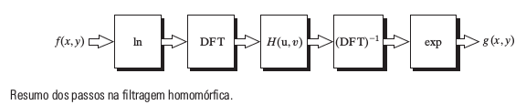
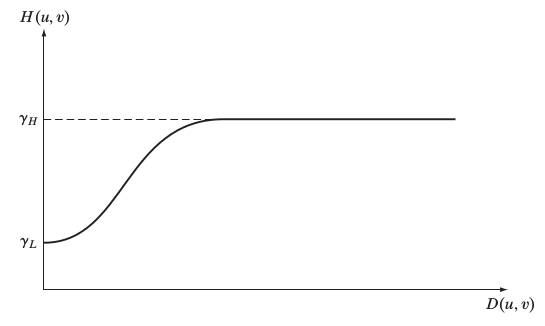
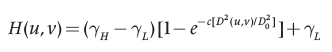

[.text-center]
= ATIVIDADES UNIDADE 2:
:stem: latexmath

[.text-center]
== FILTRAGEM NO DOMÍNIO DA FREQUÊNCIA

[.text-center]
=== 8.2 - EXERCÍCIO:

[.text-left]
	Utilizando o programa exemplos/dft.cpp como referência, implemente o filtro homomórfico para melhorar imagens com iluminação irregular. Crie uma cena mal iluminada e ajuste os parâmetros do filtro homomórfico para corrigir a iluminação da melhor forma possível. Assuma que a imagem fornecida é em tons de cinza.

[.text-center]
=== SOLUÇÃO:

[.text-center]
**Filtragem Homomórfica**
[.text-left]
A filtragem homomórfica trata-se basicamente de uma abordagem que opera sobre as componentes de iluminação e reflectância separadamente. Em que ela atenua as baixas-frequências e realça as altas. 

Como mostrado na equação abaixo:

[.text-center]
stem:[f(x,y)=i(x,y)r(x,y)]
[.text-left]
Em que esse método de filtragem é deduzido na seguinte imagem:

[.text-left]
O filtro homomórfico funciona com a idéia de que a "iluminação" é a componente de baixa-frequência e a "reflectância" é a componente de alta-frequência. Onde aumenta-se o contraste se a iluminação é diminuida (i<1) e a reflectância é aumentada (r>1). 
Nessa transição pode-se utilizar qualquer curva, mas geralmente utiliza-se Butterworth ou Gaussiano. 

Podemos ver na figura abaixo um corte transversal de um filtro como esse. 

E logo abaixo temos também uma forma ligeiramente modificada do filtro passa-alta gaussiano.

Abaixo temos o código de implementação do filtro:

.homomorfic.cpp
++++

++++

